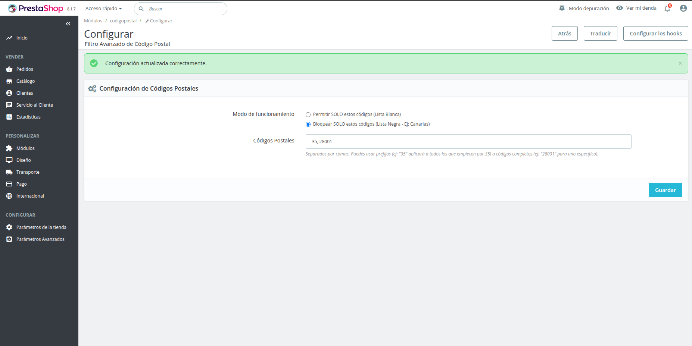
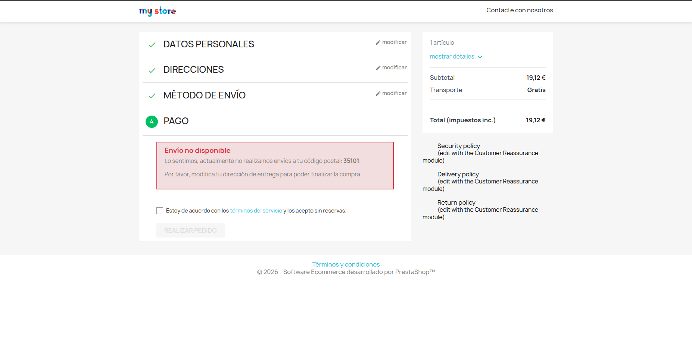

# 📦 PrestaShop Module: Filtro Avanzado de Código Postal (v1.2.0)

Este es un módulo personalizado y avanzado para PrestaShop (compatible con versiones 1.7.x y 8.x) diseñado para restringir las compras basándose en el código postal del cliente durante el proceso de pago (Checkout).

## ✨ Características principales
* **Listas Blancas y Negras:** El administrador puede elegir entre permitir solo ciertos códigos o bloquear códigos específicos (Ideal para bloquear envíos a Canarias, Ceuta o Melilla).
* **Búsqueda Inteligente por Prefijo:** No es necesario escribir todos los códigos. Escribiendo `35`, el módulo bloqueará automáticamente todos los códigos postales que empiecen por 35 (Las Palmas).
* **Bloqueo dinámico:** Impide finalizar la compra eliminando los métodos de pago y mostrando un aviso visual claro.
* **Integración nativa:** Utiliza los *Hooks* estándar de PrestaShop (`displayPaymentTop`) para garantizar máxima compatibilidad con el core y otras plantillas.

## 📸 Capturas de Pantalla

### Panel de Configuración (Backoffice)

### Bloqueo en el Checkout (Frontoffice)

---

## 🛠️ Entorno de Desarrollo
Este módulo ha sido desarrollado utilizando un entorno aislado con **Docker** (Apache, PHP 8.1 y MariaDB) para garantizar unas pruebas limpias y un rendimiento óptimo.

## 🚀 Instalación y Pruebas

### Opción A: Instalación Rápida (Tienda en Producción) 🛒
1. Descarga el archivo `codigopostal.zip` (puedes generarlo comprimiendo la carpeta `src_modulo/codigopostal`).
2. En el Backoffice de tu PrestaShop, ve a **Módulos > Gestor de Módulos**.
3. Haz clic en **Subir un módulo** y selecciona el archivo `.zip`.

### Opción B: Probar en Entorno de Desarrollo Local (Docker) 🐳
Este repositorio incluye un entorno completo y preconfigurado:
1. Clona este repositorio: `git clone https://github.com/robertocmt13/prestashop-filtro-codigopostal.git`
2. Copia el archivo de entorno: `cp .env.example .env`
3. Levanta el servidor: `docker compose up -d`
4. Accede a `http://localhost:8081/admin_dev` (Usuario: `demo@prestashop.com` / Pass: `prestashop_demo`).
*(Nota: Si no te deja entrar al backoffice, elimina la carpeta `install` dentro de `ps_data`).*

---
**Desarrollado por:** Roberto Carlos Moyano  
**Rol:** Fullstack Developer & SysAdmin